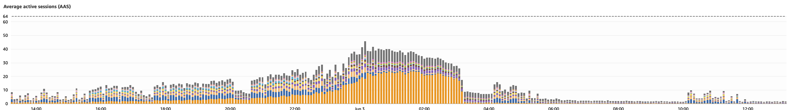

# Optimization

## Backstory, continued

The query that you can see below is the one that was causing the load on the database.

Through much troubleshooting, I was able to see that this query was called not directly
by the user, but by a thread that was kicked off when the user logged in or refreshed their access.
This thread was not directly visible in the default views in NewRelic, which were more focused
on the web-facing request threads, not background threads.

The purpose of this query was more for feeding data into another system, which isn't all that
important for this demo. And, it should be noted that this other system did not really
need to be fed data nearly as frequently as this setup was doing, but again, this was
a system that was pretty much off limits for changing unless it was really necessary.

It turns out adding indexes was a far easier solution than trying to optimize how the query was being used.

The intent of the results from the query was to get the most recent session information for each
device associated with the user. If a user was using their iPhone, their iPad, and their desktop,
regardless of how many times they logged in, this should have produced 3 records. At
least that was the intent - since the `user_agent` was part of the results, a singular
device could have multiple user agents between different sessions, so in reality more than
3 records would have been returned. Again, fixing that was off the table.


<!-- plan -->
```sql
SELECT DISTINCT s.device_id, d.created_at, s.user_agent, dt.name
FROM sessions s
         JOIN devices d ON d.id = s.device_id
         JOIN users u ON u.id = s.user_id
         LEFT JOIN device_types dt ON dt.id = d.device_type_id
WHERE u.username= 'jillrhodes@hotmail.com'
ORDER BY d.created_at DESC;
```
## Add basic indexes

First, lets make sure we have indexes on any field that would be used as part of a foreign key
or used directly in a where clause.

This thankfully was more or less the state of the database when I started to work on improving it.

```sql
create index concurrently ix_sessions_device_id on sessions(device_id);
create index concurrently ix_sessions_user_id on sessions(user_id);
create index concurrently ix_devices_user_id on devices(user_id);
create index concurrently ix_users_username on users(username);
vacuum analyze;
```

<!-- plan -->
```sql
SELECT DISTINCT s.device_id, d.created_at, s.user_agent, dt.name
FROM sessions s
         JOIN devices d ON d.id = s.device_id
         JOIN users u ON u.id = s.user_id
         LEFT JOIN device_types dt ON dt.id = d.device_type_id
WHERE u.username= 'jillrhodes@hotmail.com'
ORDER BY d.created_at DESC;
```
This isnt too bad, the cost is only in the 60's, far better than the 17,000 without any
reasonable indexes. We have three index scans, and one bitmap index scan, and no seq scans (ie: full table scans).

But, this query is happening thousands of times per minute, and on very large tables.
This is causing the database to be very busy reading from disk. Even with 4 scans using indexes,
the database still has to go back to the much larger base tables to get some data.

We can do better.

## Add Covering Indexes

A covering index is a regular index that provides all the data required for a query without
having to access the full table. This includes columns used in a where clause, a join, or
returned by a select statement.

If we can make good covering indexes, index scans and bitmap index scans can become "index only scans".

```sql
create index concurrently ix_users_cover on users (username) include (id);
create index concurrently ix_sessions_cover on sessions (user_id) include (device_id, user_agent);
create index concurrently ix_devices_cover on devices (id ASC,created_at DESC) include (device_type_id,created_at);

vacuum analyze;
```

When this 

<!-- plan -->
```sql
SELECT DISTINCT s.device_id, d.created_at, s.user_agent, dt.name
FROM sessions s
         JOIN devices d ON d.id = s.device_id
         JOIN users u ON u.id = s.user_id
         LEFT JOIN device_types dt ON dt.id = d.device_type_id
WHERE u.username= 'jillrhodes@hotmail.com'
ORDER BY d.created_at DESC;
```

You can see the results of this from a screenshot taken from Performance Insights in RDS. The orange bars
that are clearly visible on the left half of the chart suddenly went away when the index was created. The
other colored bars are the rest of the queries that were on this instance, and it should be clear to see
that this one query type accounted for a significant portion of the overall load until the index was added.



```sql
SELECT
    relname AS object_name,
    pg_size_pretty(pg_total_relation_size(pg_class.oid)) AS total_size
FROM pg_class
JOIN pg_namespace ON pg_namespace.oid = pg_class.relnamespace
WHERE pg_namespace.nspname = current_schema()
  AND relkind IN ('r', 'i')
ORDER BY total_size DESC;
```